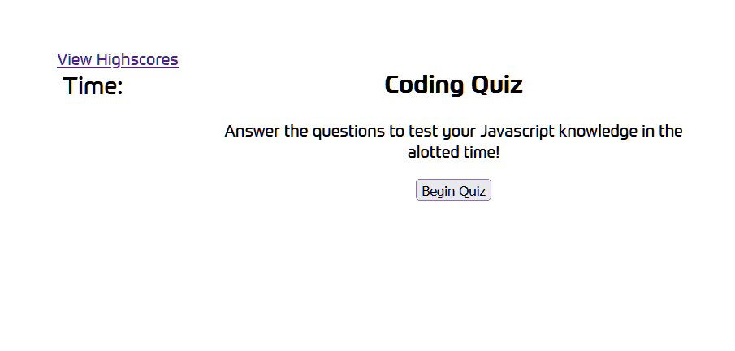

 

<h1 align="center">Javascript Quiz</h1>

  

    Javascript Quiz built for UW Boot Camp.
     
    Includes timer function that decreases for wrong answers, score tracking via localStorage.
     
    <a href="https://shiver750.github.io/Coding-Quiz/">Click here to access quiz!</a>
  

<!-- ABOUT THE PROJECT -->
## About The Project
 

<!-- USAGE EXAMPLES -->
## Usage

Test your JS knowledge, or use this code to help with your own work :).

<!-- CONTACT -->
## Contact
<a href="https://www.linkedin.com/in/matt-szmytkowski-5418071a6/">Linkedin</a>
